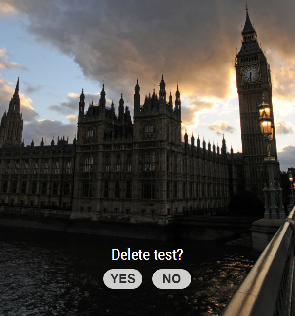

# MMM-TouchPrompt

A module for the [MagicMirror²](https://github.com/MichMich/MagicMirror/) that shows a message prompt and associated Yes/No buttons, for use on a touch screen.



## Installing

### Step 1 - Install the module
```javascript
cd ~/MagicMirror/modules
git clone https://github.com/jheyman/MMM-TouchPrompt.git
```

### Step 2 - Add module to `config.js`
Add this configuration into your `config.js` file
```javascript
{
    module: "MMM-TouchPrompt",
    position: <some MM area where you want to prompt to show up, I chose "bottom_center">,
}
```

## Dependencies

None

## Configuration

No configurable parameter at this time.

# Working with the prompt

## Invoking the prompt

To show the prompt message and buttons, send a notification to this module:
```

this.sendNotification("PROMPT_YESNO", {
	text:"Your prompt message here", 
	yesNotification: {event: "<name of the notification to be sent back if user clicks YES>", payload: {payload to be sent back in the notification, may contain a unique identifier for example}}, 
	noNotification: {event: "<name of the notification to be sent back if user clicks NO>", payload: {payload to be sent back in the notification, may contain a unique identifier for example}}, 
	});
```

## Receiving the callback notification

When the user touches the YES or  NO button, the module sends back the configured notification back.
You can fetch this message by checking for the `key` component. Here an example:


